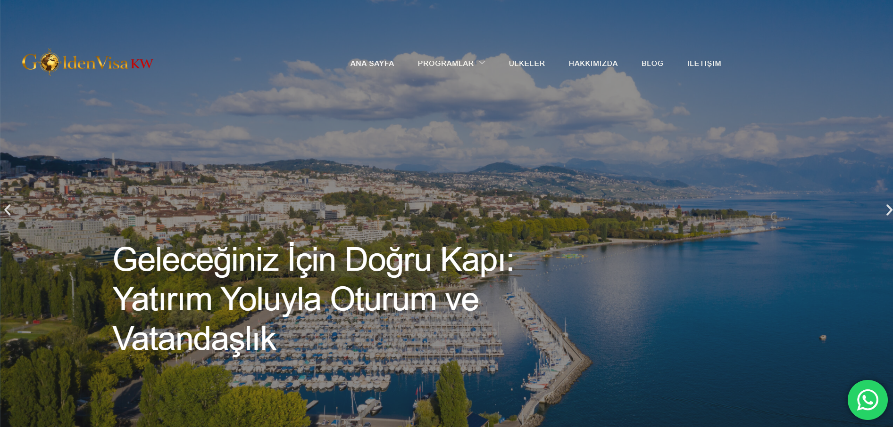

<div align="center">

# 🌍 GoldenVisaKW

### Global Investment • Residency • Citizenship Platform

A modern **investment, residency and citizenship portal** designed to present international opportunities with a premium corporate experience.

🌐 **Live Demo**  
https://goldenvisakw.com

</div>

---

# ✨ Overview

**GoldenVisaKW** is a modern corporate web platform created for international investors and clients who want to explore:

• residency by investment  
• citizenship by investment  
• global real estate opportunities  
• corporate consultancy services  

The project combines **premium presentation**, **lead generation**, **country-based content architecture**, and **scalable backend infrastructure** in one system.

Its main goal is to provide a strong digital showcase for consultancy, investment, and global mobility services.

---

# 🚀 Features

🏡 **Country & Program Pages**

Detailed pages for citizenship, residency, and investment programs, including:

* country-specific opportunities  
* investment requirements  
* key benefits  
* process summaries  

---

💼 **Corporate Presentation Structure**

A premium layout designed for trust and conversion:

* modern hero sections  
* service-focused content blocks  
* investor-friendly information architecture  
* strong brand presentation  

---

📊 **Investor-Focused Experience**

Each listing is structured to support decision-making:

* ROI insights (planned)  
* location-based advantages  
* long-term investment value  

---

📩 **Lead Generation System**

Built to collect potential client inquiries through:

* consultation forms  
* contact pages  
* country/program interest forms  
* structured conversion points  

---

🌐 **Multi-Language Ready Architecture**

The system is prepared for international expansion with support for:

* multi-language content structure  
* region-based experience improvements  
* scalable country/service pages  

---

📱 **Responsive Design**

Optimized for:

* desktop  
* tablet  
* mobile devices  

---

⚡ **Performance-Focused Build**

The project is structured to support:

* fast page loads  
* clean frontend output  
* scalable backend logic  
* SEO-friendly page hierarchy  

---

# 🛠 Tech Stack

| Technology | Purpose |
| ---------- | ------- |
| Laravel    | Backend framework |
| Blade      | Templating engine |
| MySQL      | Database management |
| HTML5      | Page structure |
| CSS3       | Styling and layout |
| JavaScript | Interactive components |

The platform is developed with a clean and scalable architecture suitable for long-term growth.

---

# 📂 Project Structure

```text
project-root/
│
├── app/
├── bootstrap/
├── config/
├── database/
├── public/
│   ├── assets/
│   ├── images/
│   └── index.php
│
├── resources/
│   ├── views/
│   ├── css/
│   └── js/
│
├── routes/
├── storage/
└── README.md
📈 Core Modules

GoldenVisaKW includes the following core modules:

Home page with premium corporate presentation

Country-based detail pages

Citizenship and residency program pages

Contact and consultation forms

SEO-friendly content sections

Expandable service architecture

Admin-ready backend foundation

🎯 Target Audience

This project is designed for:

international investors

residency and citizenship consultancy firms

global real estate clients

high-net-worth individuals

users seeking cross-border investment opportunities

🔐 Security & Architecture

The platform is built with a scalable and secure foundation, including:

Laravel-based backend architecture

form validation

structured routing

maintainable code organization

database-driven content flexibility

🔮 Future Improvements

Planned improvements for the platform:

ROI calculation tools

dynamic currency display

advanced admin panel modules

360° virtual tour integration

multilingual content management

investor dashboard features

enhanced reporting tools

CRM integration

lead tracking system

👩‍💻 Developer

Berfin Nida Öztürk

GitHub
https://github.com/berfinida

LinkedIn
https://www.linkedin.com/in/berfin-nida-%C3%B6zt%C3%BCrk-6a12131b7/

📄 License

MIT License
